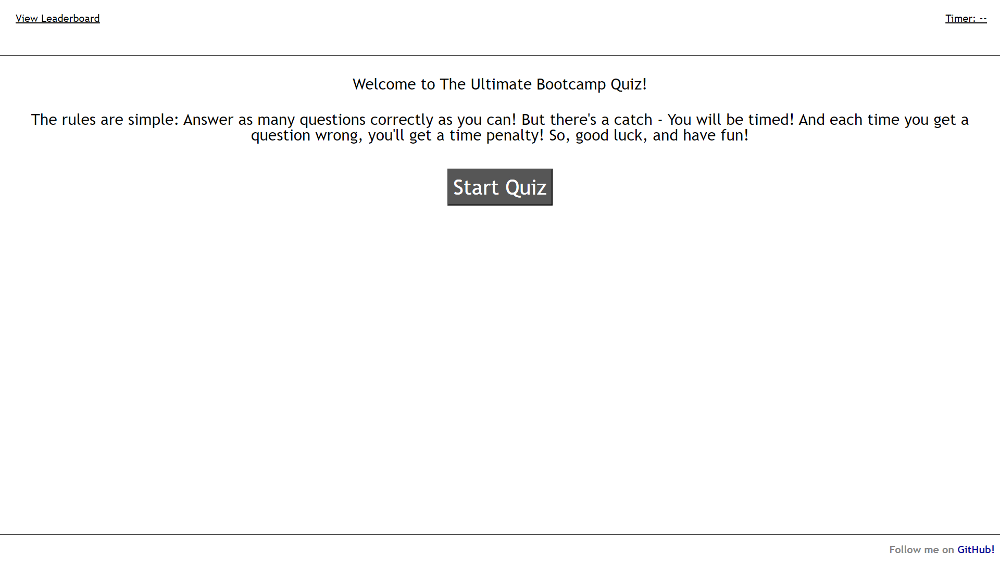
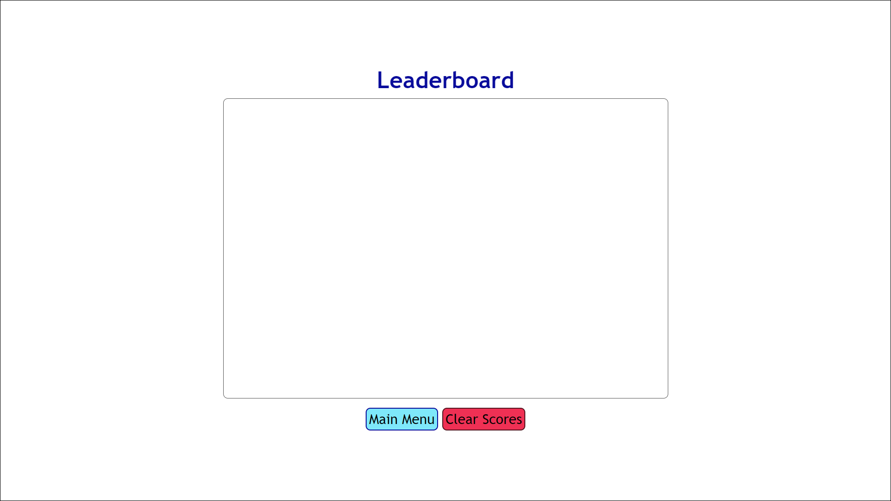

# quiz_of_the_century

## Description

I want to make a quiz for my classmates and I want users to be able to track their scores! I also want to have it timed and if you get a question wrong, well... hehehe... YOU LOSE (time)!!!

## Installation

N/A

## Usage

To use this webpage, one must simply click on the 'Start' button that appears on the front of the page. From there, there will be a series of questions for the user to answer and at the end they will save their scores by entering their initials. They can also view they're previous scores by clicking on the words 'View Leaderboard' located in the top left hand side of the screen. In the leaderboard menu, the user can click one of two buttons: 'Main Menu' and 'Clear Scores'.

  

Link to deployed application: https://koi-as.github.io/quiz_of_the_century/

## Credits

Thanks to Brittani Court who helped me display the questions and answers for the quiz!  
I used this GitHub repository to help me figure out how to change questions and save local data: https://github.com/ndifiori/Web-APIs-Code-Quiz  
I used this video as a jumping off point for my project: https://youtu.be/riDzcEQbX6k

## License

N/A